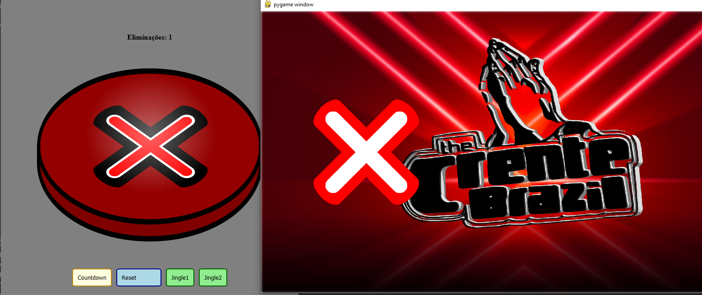

# The Crente Brasil

Esse é o repositório do código do projeto de simulação do *The Voice Brasil*
para o evento de Show de Talentos do acampamento de 2022 da PIB do Recreio.



O projeto consiste de uma página web para ser visualizada em um celular, 
que possui um botão para eliminação e outros botões para controle, além
da tela para ser exibida para todos, rodando em *pygame*

# Funcionamento

Para executar, primeiro instale os requerimentos:

```bash
> pip install -r requirements.txt
```

Depois, execute o script `main.py` para executar todas as threads necessárias,
que são o pygame, servidor, e thread de comunicação entre processos.

## Servidor

O servidor é utilizado para servir as páginas web, e enviar as mensagens para 
o processo/thread do pygame. Ele utiliza o microframework Flask

## Visualização

A visualização é uma tela pygame, que pode exibir as eliminações, o countdown,
e também emitir os sons conforme o servidor solicita.

## Comunicação entre as threads

A comunicação é feita utilizando *sockets*. Poderia ser utilizado outros métodos
de comunicação entre threads, mas este foi preferido pela sua fácil implementação,
e também caso fosse necessário que o servidor e a visualização fossem processos
diferentes.